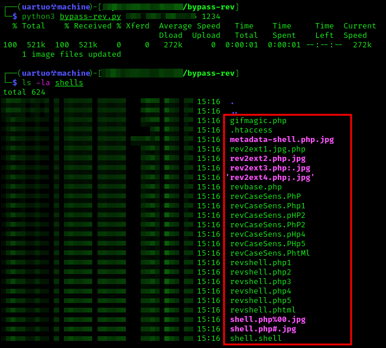

# BYPASS-PHP-REVERSE-SHELL-FILES-GEN
O objetivo do script é gerar arquivos para dar bypass em uploads de shells reversas.

## Modo de uso:

```bypass-rev.py <LHOST> <LPORT>```



## Créditos
Utilizei esse artigo como guia para a geração de arquivos com diferentes formas de bypass.
[Artigo](http://www.securityidiots.com/Web-Pentest/hacking-website-by-shell-uploading.html#whitelisting-bypass)

Utilizei a clássica revshell em php do pentest monkey.
[PentestMonkey](https://raw.githubusercontent.com/pentestmonkey/php-reverse-shell/master/php-reverse-shell.php)

## Como funciona?
O script gera mais de **20 payloads** usando como base a reverse shell do *pentest monkey* na maioria delas. Além disso insere webshell em comentáríos dos metadados de uma imagem e cria um *.htaccess* que permite a execução de arquivos .shell como **PHP**.

## To do
- Gerar outros bypasses um pouco mais complexos
- Automatizar o upload desses payloads na maioria das aplicações com funcionalidade de upload.
